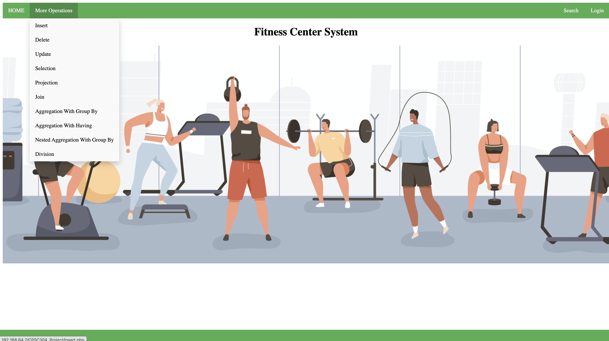
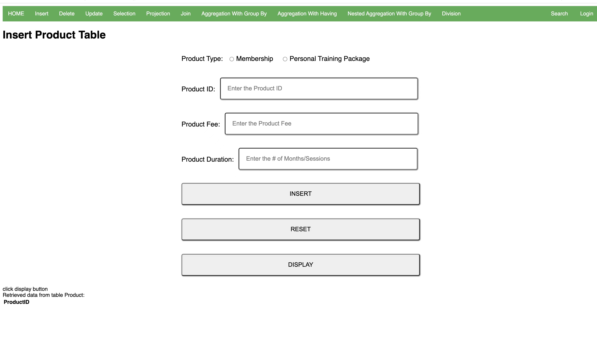
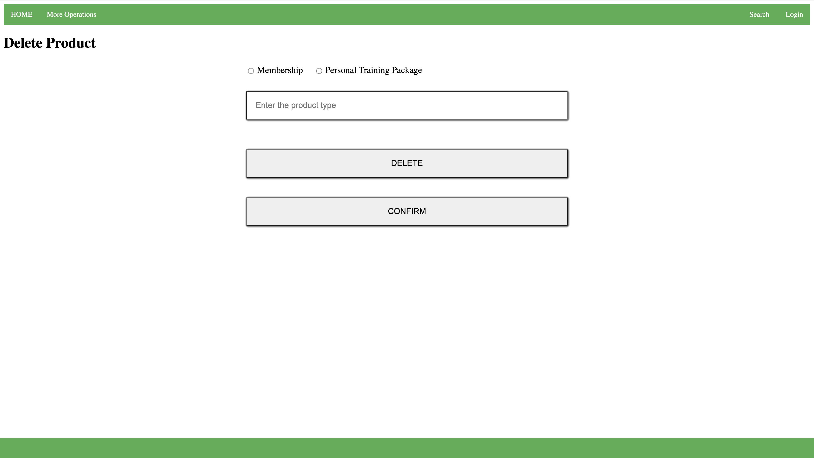

## CPSC304 Project: Fitness Center Website

Welcome to our CPSC304 project github! 

## Description
The domain we are trying to model is a fitness center. It is aiming to offer users convenience to get access to the information they need about our fitness center and/or their own information. 

We focus on product types, product orders, and training lesson arrangement between two types of users: customers, and staff.

## Functionality
- For customer 
  - The website would provide them with assistance in renting fitness equipment and purchasing membership from salesperson. Customers can keep records of their body measurements during the time they are working out in the center, which could help each customer monitor their progess and maintain motivation. Our fitness center also have 1-on-1 lesson sold by salesperson and group activities taught by trainers, so that customers can make their own workout plan according to their needs.
- For staff
  - The website would provide them with access to look at the information of each customers. It also helps keep a record of saleman's sales performance, and some teaching information of trainers.

## Application Platform 
This project will be implemented using the database management system Oracle, and the programming language that we use will be PHP. We do not anticipate using any special software or hardware for now.

